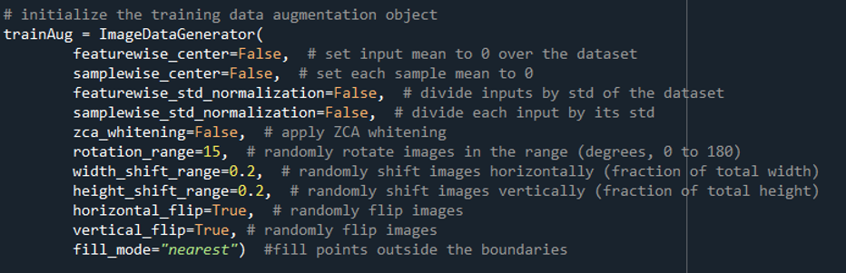

# Detecting COVID-19 in X-ray Images using CNN
Coronavirus disease 2019 (COVID-19) is an infectious disease caused by virus named SARS-CoV-2 which stands for severe acute respiratory syndrome. Since Corona virus attack the epithelial cell that line our respiratory tracts, an X-ray image of the patient’s lung can be used to analyze the presence of this disease. This report shows the computer-aided detection of the COVID-19 in an X-ray images by using convoluted neural network and Keras’ VGGNet thus automatically identifying if the patient is positive or negative for this virus
# DataSet
an open source dataset of X-ray images for patients who have tested positive for COVID-19 - Joseph Cohen Repository https://github.com/ieee8023/covid-chestxray-dataset \
X-ray Images of patients suffering from pneumonia- kaggle repository\
X-ray images of COVID-19 patients are used by doctors to diagnose pneumonia, lung inflammation, or enlarged lymph nodes
and since corona virus attack the epithelial cell that line our respiratory tracts, we can use X-ray to analyze the health of a patient’s lungs
# Limitation
Posteroanterior (PA) x-ray view is used to aid diagnosis of acute and chronic conditions hence this is the best suited view for detection of any internal linings in the respiratory tracts. Also, the dataset from Kaggle repository only contains X-ray images with PA view hence Dr. Cohen repository images should also contain the same view for the normalization of the input data.
# LowDataset: Data Augmentation
As there is an scarcity of COVID-19 X-ray Images, hence in order to train our model with great accuracy, we need more images
One way to do so is to make minor alteration to our dataset such as flip or rotations. This way neural network will think these are distant images. This method is called data augmentation 
It also reduce the problem of overfitting on model as it increase the number of images in dataset or in other words Data Augmentation prevents overfitting by modifying limited datasets to possess the characteristics of big data (variety)

 

All the methods shown here is for the experimentation purpose, all together if executed will lead to loss of accuracy. We need to check which methods are giving best output based on the images in the dataset.

# Solution-to-problem
The complete problem stated above for X-ray images classification and data-limited scenarios can be formalized as follows:
1. Sample an open source dataset of X-ray images for patients tested positive for COVID-19 and label as ‘covid’. Due to limited data apply deep learning techniques like Data Augmentation to enrich the dataset. Total of 140 images are used in this part of dataset
2. Sample ‘normal’ X-ray images for healthy (pneumonia suffering) patients. Total of 300 images are used in this part of dataset. Partitioned the data into training and testing splits using 80% of the data for training and the remaining 20% for testing
3. Train the model on VGG16 network with pre-trained ImagNet and apply fine-tuning to better optimization with softmax as output layer
4. Train the model using CNN using ADAM as an optimizer and binary cross entropy as a loss function.
5. Evaluate the quality of the classifier by asking it to predict labels for a new set of images (Test Data) that it has never seen before and compare the true labels of these images to the ones predicted by the classifier.
